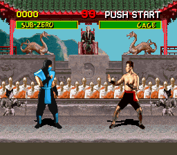

# MortalKombatOpenAI
An implementation of a Double Dueling Deep Q Network on the original Mortal Kombat Snes game

Read the article [here](https://github.com/TimoleonLatinopoulos/MortalKombatOpenAI/blob/master/article/Deep%20Reinforcement%20Learning%20for%20Fighting%20Games.pdf)
